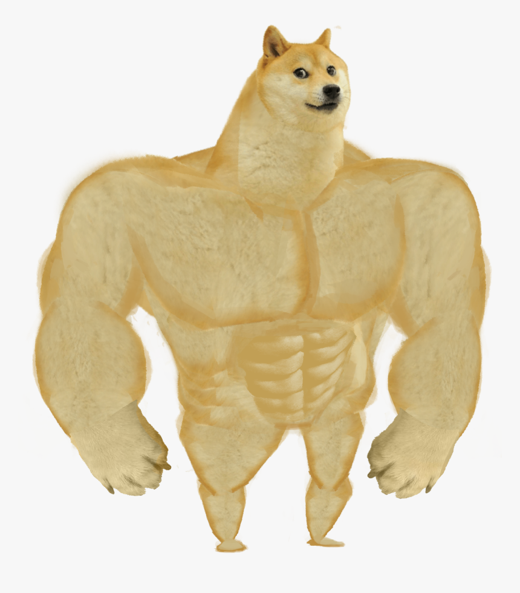
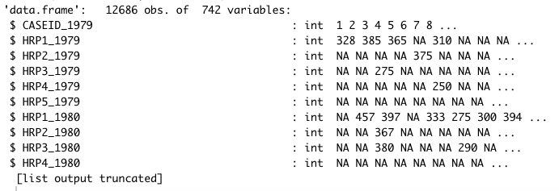
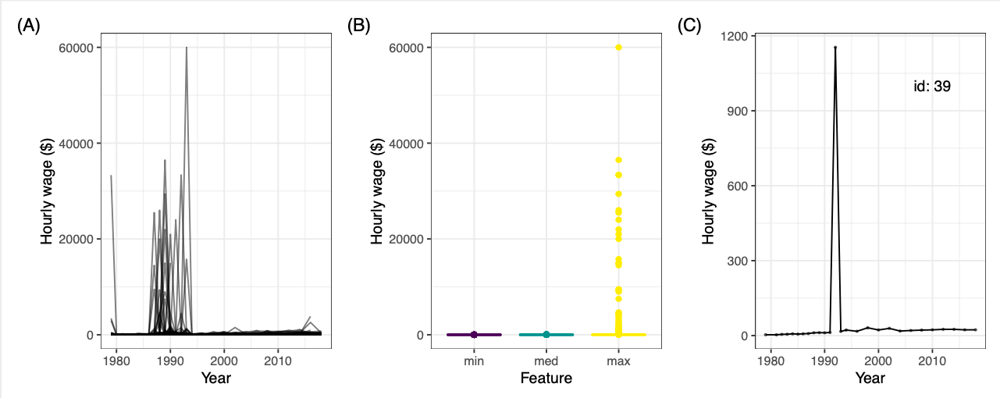

```{r setup, include=FALSE}
options(htmltools.dir.version = FALSE)
```

```{r xaringan-themer, include=FALSE, warning=FALSE}
library(xaringanthemer)
style_duo_accent(
  primary_color = "black",
  secondary_color = "#FF961C",
  inverse_header_color = "#FFFFFF"
)
```

```{r setup-chunk, echo = FALSE, cache = FALSE, include = FALSE}
library(knitr)
opts_chunk$set(echo = FALSE, 
               warning = FALSE, 
               message = FALSE,
               cache = TRUE, 
               cache.path = "cache/",
               fig.retina = 3)

library(tidyverse)
library(fontawesome)
library(patchwork)
```

class: center

background-image:url(images/cover.png)
background-size: cover

---

class: top, left

background-image:url(images/slide-bg.png)
background-size: cover

# Acknowledgment

<br>
<br>

## This work is done in collaboration with:

- Dianne Cook (Monash University)
- Emi Tanaka (Monash University)
- Nicholas Tierney (Telethon Kids Institute), and 
- Kate Hyde (Monash University)

---

class: top, left

background-image:url(images/slide-bg.png)
background-size: cover

# Traits of Ideal Data

<br> 

### Data should satisfies 3R ([Kim, Ismay, Chunn, 2018](https://scholarworks.smith.edu/cgi/viewcontent.cgi?article=1044&context=mth_facpubs)):

1. **Rich** enough to answer meaningful questions;
2. **Real** enough to ensure the existence of a context;
3. **Realistic** enough to convey that pre-processing is often needed;

--

### On another side: 

> For learning and teaching of statistics/data science-purposes, or textbook's data, the prerequisite to analyze the data should ideally be minimum ([Cobb, 2015 in Kim, Ismay, Chunn, 2018](https://scholarworks.smith.edu/cgi/viewcontent.cgi?article=1044&context=mth_facpubs)).

---

class: center

background-image:url(images/slide-bg.png)
background-size: cover

# Tame vs Wild Data

.pull-left[

### Wild data

```{r wild-doge, out.width = "50%"}

```

The 3rd R of ideal data.

]

.pull-right[

### Tame data

```{r tame-doge, out.width = "60%"}

```

Minimum prerequisite.
]

---
class: top, left

background-image:url(images/slide-bg.png)
background-size: cover

# `r emo::ji("target")` The Goal

<br>

.center[
## Dataset that is **rich**, **real**, **tidy**, **clean**.

```{r arrow, out.width = "15%"}

```

## Tame data
]

---
class: top, left

background-image:url(images/slide-bg.png)
background-size: cover

# Taming the Wild Data: Works to Do

.left[
**Data science pipeline** 
([Wickham & Grolemund, 2017](https://r4ds.had.co.nz/index.html#welcome))
]

.center[

]

--
<br>
.left[
**Statistical value chain** 
([van der Loo & de Jonge, 2018](https://r4ds.had.co.nz/index.html#welcome))
]

.center[

```{r svc, out.width = "50%"}

```


]

---
class: top, left

background-image:url(images/slide-bg.png)
background-size: cover

# What is the Problem?

> Most of the time is spent for data preparation, yet it is the least enjoyable task.

.center[
.pull-left[
```{r task, out.width = "80%"}
task <- tribble(~"task",  ~"portion",
                "building training sets", 3,
                "cleaning and organizing data", 60,
                "collecting data sets", 19,
                "mining data for patterns", 9,
                "refining algorithms", 4,
                "other", 11) %>%
  mutate(clean = as.factor(ifelse(task %in% c("cleaning and organizing data", 
                                              "collecting data sets"), "yes", "no")))

ggplot(task, aes(x = portion, y = reorder(task, portion), fill = clean)) +
  geom_col() +
  geom_text(aes(label = paste0(portion, "%")), hjust = 1, color = "white") +
  ggtitle("A.) Time spent for data science task") +
  theme_bw() +
  xlab("Portion of time (%)") +
  ylab("Task") +
  theme(legend.position = "none",
        axis.text.x = element_text(size = 14)) +
  scale_fill_manual(values = c("grey65", "#45B39D")) +
  labs(caption = "Source: CroudFlower's 2016 State of Data Science report")
```
]

.pull-right[

```{r enjoy, out.width = "80%"}
enjoy <- tribble(~"task",  ~"portion",
                "building training sets", 10,
                "cleaning and organizing data", 57,
                "collecting data sets", 21,
                "mining data for patterns", 3,
                "refining algorithms", 4,
                "other", 5) %>%
  mutate(clean = as.factor(ifelse(task %in% c("cleaning and organizing data", 
                                              "collecting data sets"), "yes", "no")))

ggplot(enjoy, aes(x = portion, y = reorder(task, portion), fill = clean)) +
  geom_col() +
  geom_text(aes(label = paste0(portion, "%")), hjust = 1, color = "white") +
  ggtitle("A.) The least enjoyable task in data science") +
  theme_bw() +
  xlab("Data scientist (%)") +
  ylab("Task") +
  theme(legend.position = "none",
        axis.text.x = element_text(size = 14)) +
  scale_fill_manual(values = c("grey65", "#45B39D")) +
  labs(caption = "Source: CroudFlower's 2016 State of Data Science report")
```

]
]

---

class: top, left

background-image:url(images/slide-bg.png)
background-size: cover

# Another Problem


<br> 
###"Data cleaning and preparation are often neglected or disorganized and decision made during these steps are often unreported." ([Huebner, Vach, le Cessie, 2016](https://www.sciencedirect.com/science/article/pii/S0022522315017948))

--

.center[

```{r arrow-again, out.width = "15%"}

```
]

--

.center[**Lack of Reproducibility**]

---
class: top, left

background-image:url(images/slide-bg.png)
background-size: cover

# Case Study: `yowie`

.left-code[

```{r yowie-logo, out.width = "60%", fig.align='center'}

```
]

.right-plot[

Stands for **Y**ears **o**f **W**ages to **I**nvestigate and **E**xplore

<style>
div.blue { background-color:#E8F8F5; border-radius: 5px; padding: 20px;}
</style>
<div class = "blue">

An `r fa("r-project", fill = "steelblue")` package contains longitudinal wages datasets and several demographic variables of the <a href="https://www.nlsinfo.org/content/cohorts/nlsy79">National Longitudinal Survey of Youth 1979</a> cohort. The period covered is 1979-2018.

</div>

The aim is to provide longitudinal data that is suitable for learning and teaching longitudinal data
with **reproducibility and transparency emphasized**.

3 datasets in the package:

- Demographic data of the NLSY79 cohort.
- Longitudinal wages data of the NLSY79 cohort.
- Longitudinal wages data of high school dropouts subset of the NLSY79 cohort (the refreshed version of Singer & Willet's (2003); This data is only from 1979 - 1994) 
]

---
class: top, left

background-image:url(images/slide-bg.png)
background-size: cover

# Why wages data from NLSY79?


- NLSY79 covers various variable and has been used in research in various discipline (Pergamit at al., 2001).
- The survey is carefully designed with high retention rates so it suitable for life course research (Pergamit et al. 2001; Cooksey 2017).
- The data has been widely used in textbook, including in Singer and Willet (2003). It has been used in teaching of exploratory data analysis. This data is also used as example data in `brolgar` (Tierney, Cook & Prvan, 2020)

--

**Variables included in the original data**

<style>
div.blue { background-color:#E8F8F5; border-radius: 5px; padding: 20px;}
</style>
<div class = "blue">
The original data (Singer and Willet, 2003) covers the variables of ID of the data, wages, work experience, GED status, highest grade completed, dummy variable of whether the ID belongs to Black or Hispanic group, and the unemployment rate. 
</div>

--

**Variables included in the refreshed data**

<style>
div.blue { background-color:#E8F8F5; border-radius: 5px; padding: 20px;}
</style>
<div class = "blue">
The same variables with the original data (except the unemployment rate) with some other variables to enrich the analysis (e.g., gender, year when start working) and to improve transparency (whether the data is imputed or not). 
</div>

---
class: top, left

background-image:url(images/slide-bg.png)
background-size: cover

# Getting the Data

The data is publicly available in the [NLS Investigator website](https://www.nlsinfo.org/investigator/pages/search?s=NLSY79). 

```{r nls, out.width = "50%", fig.align='center'}

```

--
😊 We can create a tagset which contains the variables name -> 👍 for the reproducible workflow. 

--

🙁 Some variables in the original data are not explicitly available in the database -> need `r emo::ji("detective")` work.

---
class: top, left

background-image:url(images/slide-bg.png)
background-size: cover

# Tidy the Data

The downloaded NLSY79 data is not tidy 
--
**->** The 3rd "R" in the criteria of ideal data. 

--

```{r raw, out.width = "60%", fig.align='center'}

```

--

- Done by using `tidyverse` (Wickham, Averick, et al. 2019) to pivot longer the data, rename the variables, and change the data type with appropriate data type.

--

- The wages data frame is saved in `tsibble` (Wang, Cook, Hyndman, 2020), a data frame class that is suitable for temporal data. 

---
class: top, left

background-image:url(images/slide-bg.png)
background-size: cover

# `r emo::ji("detective")` On the Quest for `experience`

```{r}
xaringanExtra::use_panelset()
```


.panelset[
.panel[.panel-name[Problems]

- Singer and Willet (2003) use `experience` as the time index. 

- This variable is not explicitly available in the database **->** calculated variable.

- There is no code or explicit explanation available in the book on how `experience` is calculated from the raw data.

- The only explanation available is the length of time (in years) since entering the labor force, with 
$t_0$ for each subject starting on their first day at work.

]

.panel[.panel-name[Comparison]

- Recreate the variable based on the definition available, calculated from the year of individual started working (available in the database).

```{r, fig.align='center', fig.width = 8, fig.height = 4.5}

ori <- brolgar::wages %>%
  ggplot(aes(x = xp)) +
  geom_density() +
  xlab("Experience") +
  ylab("") +
  theme_bw() +
  ggtitle("A.) Original")

refreshed <- yowie::wages_hs_do %>%
  filter(id %in% brolgar::wages$id) %>%
  filter(year <= 1994) %>%
  ggplot(aes(x = yr_wforce)) +
  geom_density() +
  xlab("Experience") +
  ylab("") +
  theme_bw() +
  ggtitle("B.) Refreshed")

ori + refreshed
```


`r emo::ji("stop")`  Does not seems match.

]

.panel[.panel-name[Try it again]

From [the topical guide of NLSY79 data](https://www.nlsinfo.org/content/cohorts/nlsy79/topical-guide/employment/work-experience) we find:

```{r topical-guide, out.width = "40%", fig.align='center'}

```

Finally, we calculated `experience` using `number of weeks worked since the last interview`. 
]

]

---
class: top, left

background-image:url(images/slide-bg.png)
background-size: cover

# Impute Anomalies

.panelset[
.panel[.panel-name[Summary]

```{r summary, out.width = "70%", fig.align='center'}

```

⚠️ Extremely high wages observed. 

⚠️ Some IDs, for example ID=39, only experience high wages in 1 survey year 🤔

]

.panel[.panel-name[Sample]

```{r sample, out.width = "40%", fig.align='center'}

```

- ID 11041, 11146, 10262 only participated in few years of survey.
- ID 8296, 9962, possibly have error in their wage.

]

.panel[.panel-name[Treat the anomalies]

<br>
- Using robust linear model (`rlm` function from `MASS` package (Venables and Ripley 2002)) with `wage` and `year` as response and predictor, respectively.

- We build the model for each individual using nest and map function from `tidyr` (Wickham 2020) and `purrr` (Henry and Wickham 2020). 

- Each observation has weight -> this is used as a threshold to decide whether the observation is anomalies or not. 

- A thereshold of 0.12 was chosen to maintain the variability of the data.

]


.panel[.panel-name[The result]

```{r compare, out.width = "45%", fig.align='center'}

```

The extreme spikes, corresponding to anomalies, have been imputed for individuals 8296 and 9962 with their RLM's predicted value.

]

]
---
class: top, left

background-image:url(images/slide-bg.png)
background-size: cover

# Comparison with Singer & Willet's (2003)

- Comparison of the subset of dropouts cohort in refreshed and the original data.

--

- We cannot get the exact same dropouts as in the original data because the criteria of dropouts is not clearly articulated. 

--

.center[

```{r ori-ref-compare, out.width = "60%"}

```

]

---

class: top, left

background-image:url(images/slide-bg.png)
background-size: cover

# Reproducible Aspects in `yowie`

.panelset[
.panel[.panel-name[Code and Documentation]

- We made all of the cleaning and pre-processing codes and the variable tagsets file available [here](https://github.com/numbats/yowie/tree/master/data-raw).

- Also in the package's vignette (not updated yet). 

- It can be used as data cleaning example

.center[
```{r rohan-tweet, out.width = "60%"}

```
]
]

.panel[.panel-name[`shiny` app]

<br>

- We create a `shiny` (Chang, et.al., 2020) [app]() to simulate different threshold for anomalies treatment. 

- Can be found [here](https://ebsmonash.shinyapps.io/yowie_app/) 

]

.panel[.panel-name[👩🏻‍💻 Next plan]

<br>

- Add function to package to do inflation adjustment on the wages data. 
- Put the data into .csv format so it will not only be isolated in `r fa("r-project", fill = "steelblue")`.
- Create the metadata of the datasets.
- Deposit it in place like Zenodo. 

]

]

---

class: top, left

background-image:url(images/slide-bg.png)
background-size: cover

# Takeaways and Summary

<br>

- This case study has shown that documentation (codes and metadata) is really essential to ensure reproducibility. 

--

- Several difficulties encountered in the absence of it:

  - Deciding the variables to be downloaded.

  - Calculating the `experience`.

  - Treating the outliers.

  - Subsetting the high school dropouts.

  - Matching the original and the refreshed data.
  
--

- A better validation rule is suggested to be applied for the data providers in the data entry stage. 

---

class: center, middle

background-image:url(images/slide-bg.png)
background-size: cover

# <span style="color:black"> Thankyou! </span>

The slide and it's code can be found in https://github.com/Dewi-Amaliah/TWR-2022. 

This made with `xaringan` (Xie, 2019) in `rmarkdown` (Xie, Dervieux, Riederer, 2020)

---

class: top, left

background-image:url(images/slide-bg.png)
background-size: cover

# References 

Aden-Buie, Garrick (2020). xaringanthemer: Custom 'xaringan' CSS Themes. R package version
  0.3.0. https://CRAN.R-project.org/package=xaringanthemer

Bureau of Labor Statistics, U.S. Department of Labor. 2021a. “National Longitudinal Survey of Youth 1979 Cohort, 1979-2016 (Rounds 1-28).” Produced and distributed by the Center for Human Resource Research (CHRR), The Ohio State University. Columbus, OH, through https://www.nlsinfo.org/bibliography-citing-nls-data.

Cooksey, Elizabeth C. 2017. “Using the National Longitudinal Surveys of Youth (Nlsy)
to Conduct Life Course Analyses.” In Handbook of Life Course Health Development, edited by Richard M. Lerner Neal Halfon Christoper B. Forrest, 561–77. Cham: Springer. https: //doi.org/https://doi.org/10.1007/978-3-319-47143-3_23.

CrowdFlower. (2016). 2016 Data Science Report. https://visit.figure-eight.com/rs/416-ZBE-142/images/CrowdFlower_DataScienceReport_2016.pdf

Henry, Lionel and Hadley Wickham. (2020). purrr: Functional Programming Tools. R package version
  0.3.4. https://CRAN.R-project.org/package=purrr


Huebner, Marianne, Werner Vach, and Saskia le Cessie. (2016). “A Systematic Ap- proach to Initial Data Analysis Is Good Research Practice.” The Journal of Thoracic and Cardiovascular Surgery 151 (1): 25–27.


---

class: top, left

background-image:url(images/slide-bg.png)
background-size: cover

# References 


Grolemund, G., & Wickham, H. (2017). R for Data Science. O’Reilly Media.

Kim, Albert Y.; Ismay, Chester; and Chunn, Jennifer, "The fivethirtyeight R package: ‘Tame Data’ Principles for Introductory Statistics and Data Science Courses" (2018). Mathematics and Statistics: Faculty Publications, Smith College, Northampton, MA. https://scholarworks.smith.edu/mth_facpubs/47

Pergamit, Michael R., Charles R. Pierret, Donna S. Rothstein, and Jonathan R. Veum.
(2001). “Data Watch: The National Longitudinal Surveys.” The Journal of Economic Perspectives 15 (2): 239–53.

Singer, Judith D, and John B Willett. 2003. Applied Longitudinal Data Analysis: Modeling Change and Event Occurrence. Oxford u.a: Oxford Univ. Pr.

Tierney, N. J., Cook, D., & Prvan, T. (2020). brolgar: An R package to BRowse Over
  Longitudinal Data Graphically and Analytically in R. In arXiv [stat.AP]. arXiv.
  http://arxiv.org/abs/2012.01619

van der Loo, Mark P. J., and Edwin de Jonge. (2021). “Data Validation Infrastructure for R.” Journal of Statistical Software 97 (10): 1–31. https://doi.org/10.18637/jss. v097.i10.

Venables, W. N. & Ripley, B. D. (2002) Modern Applied Statistics with S. Fourth Edition.
  Springer, New York. ISBN 0-387-95457-0
  
---

class: top, left

background-image:url(images/slide-bg.png)
background-size: cover

# References 

Wang, E, D Cook, and RJ Hyndman (2020). A new tidy data structure to support exploration and
  modeling of temporal data, Journal of Computational and Graphical Statistics, 29:3, 466-478,
  doi:10.1080/10618600.2019.1695624.

Wickham et al., (2019). Welcome to the tidyverse. Journal of Open Source Software, 4(43),
  1686, https://doi.org/10.21105/joss.01686
  
Wickham, Hadley. (2021). tidyr: Tidy Messy Data. R package version 1.1.3.
  https://CRAN.R-project.org/package=tidyr
  
Xie, Yihui. (2020). xaringan: Presentation Ninja. R package version 0.17.
  https://CRAN.R-project.org/package=xaringan

Xie, Yihui and Christophe Dervieux and Emily Riederer (2020). R Markdown Cookbook. Chapman and
  Hall/CRC. ISBN 9780367563837. URL https://bookdown.org/yihui/rmarkdown-cookbook.


